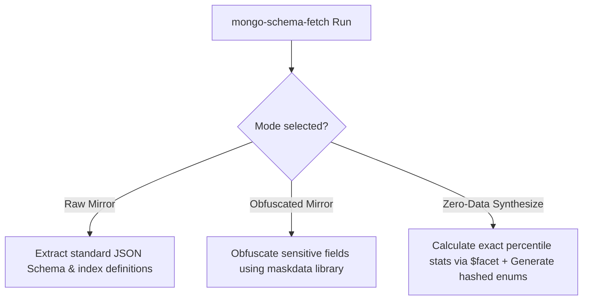

# ToDo Task: Multi-Mode Support — mongo-schema-fetch Extensions (E2E Test Specifications)

## 1. Description
This task specifies the extensions required in our owned external dependency `mongo-schema-fetch` (NodeJS Client CLI) to support the three database sandboxing modes:
1. **Raw Mirror Mode**
2. **Obfuscated / Masked Mirror**
3. **Zero-Data Percentile Synthesize**

This specification incorporates the popular **`maskdata`** npm library for PII masking and defines 10 granular, step-by-step E2E acceptance tests for each sandboxing scenario.

---

## 2. Sandbox Mode Support Mapping & Library Stack



### 2.1. Raw Mirror Mode
*   **Behavior**: Standard document sampling and index extraction. No masking or tokenization is applied.

### 2.2. Obfuscated / Masked Mirror (Using `maskdata`)
*   **Behavior**: Scrambles sensitive information while preserving overall field types and structures.
*   **Library**: **`maskdata`** (npm library for JSON/Object PII masking).
*   **Obfuscation Options Configuration**:
    Configure `maskdata` with field name patterns to detect PII matching our rules:
    ```javascript
    import maskData from 'maskdata';

    const maskOptions = {
      cardFields: ['creditCard', 'card'],
      emailFields: ['email'],
      phoneFields: ['phone', 'mobile'],
      passwordFields: ['password', 'pwd', 'pass', 'secret', 'token', 'apiKey', 'api_key'],
      stringFields: ['name', 'surname', 'address', 'street', 'city', 'ssn', 'social'],
      maskWith: 'x',
      maxMaskedCharacters: 16
    };
    ```
*   **Processing Rules**:
    *   Walk the sampled documents. Apply `maskData.maskJSONFields(doc, maskOptions)` to obfuscate sensitive properties.
    *   Enums listed in the schema `enumValues` and keys (`_id` or fields ending in `_id`) are excluded from masking to preserve query validation integrity.

### 2.3. Zero-Data Percentile Synthesize
*   **Behavior**: Runs exact percentile selectivity checks using `$facet` queries on the database.
*   **Obfuscated Query Generation**:
    *   Create a 256-bit ephemeral key `K` via `crypto.randomBytes(32)` at CLI startup.
    *   HMAC hash categorical strings in the query and schema `enumValues` using `crypto.createHmac('sha256', K)`.

---

## 3. Comprehensive Acceptance Test Cases

### Scenario 1: Obfuscated / Masked Mirror Mode (10 E2E Tests)

*   **Test 1.1: Name Masking Verification**
    *   *Input Document*: `{"name": "John Smith"}`
    *   *Execution command*: `npx mongo-schema-fetch "mongodb://..." --sanitize-pii`
    *   *Verification*: Assert field `name` in the masked document matches `"Jxxx Sxxxx"` (first letters kept, rest replaced with `'x'`, spaces preserved).
*   **Test 1.2: Email Masking Verification**
    *   *Input Document*: `{"email": "alice.wonder@domain.com"}`
    *   *Verification*: Assert field `email` matches `"axxx.xxxxxx@xxxxxx.xxx"`.
*   **Test 1.3: Phone Number Formatting Retention**
    *   *Input Document*: `{"phone": "+1-555-890-1234"}`
    *   *Verification*: Assert field `phone` matches `"+9-999-999-9999"`.
*   **Test 1.4: Credit Card Boundary Masking**
    *   *Input Document*: `{"creditCard": "4111222233334444"}`
    *   *Verification*: Assert field matches `"4111-xxxx-xxxx-4444"`.
*   **Test 1.5: String Key Preservation**
    *   *Input Document*: `{"user_id": "usr_90123"}`
    *   *Verification*: Assert field `user_id` remains exactly `"usr_90123"`.
*   **Test 1.6: ObjectId Hex Preservation**
    *   *Input Document*: `{"_id": "60a4f8e5f1b2c3d4e5f6a7b8"}`
    *   *Verification*: Assert `_id` matches `"60a4f8e5f1b2c3d4e5f6a7b8"`.
*   **Test 1.7: Low-Cardinality Enum Exclusion**
    *   *Input Document*: `{"status": "active"}` (where enumValues is `["active", "pending"]`)
    *   *Verification*: Assert `status` remains `"active"`.
*   **Test 1.8: Numeric Field Preservation**
    *   *Input Document*: `{"age": 28, "salary": 95000}`
    *   *Verification*: Assert `age` remains `28` and `salary` remains `95000` (numbers are not scrambled).
*   **Test 1.9: Nested Array Document Masking**
    *   *Input Document*: `{"contacts": [{"name": "Bob", "email": "bob@test.com"}]}`
    *   *Verification*: Assert nested properties are recursively masked: `[{"name": "Bxx", "email": "bxx@xxxx.xxx"}]`.
*   **Test 1.10: CLI Safe Exit Code**
    *   *Step*: Run CLI with `--sanitize-pii`.
    *   *Verification*: Verify process exit code is `0` and the output `schema-payload.json` is generated successfully.

---

### Scenario 2: Zero-Data Percentile Synthesize Mode (10 E2E Tests)

*   **Test 2.1: Ephemeral Key Generation Check**
    *   *Step*: Run CLI with `--hash-values` twice.
    *   *Verification*: Inspect both schema outputs. Assert the generated hash value for the same enum string is different between run 1 and run 2.
*   **Test 2.2: HMAC-SHA256 Token Length**
    *   *Step*: Hash a field value `"pending"`.
    *   *Verification*: Assert the resulting token length is exactly 16 characters.
*   **Test 2.3: Lower-Than Selectivity Ratio ($lt)**
    *   *Database Seed*: 10 documents: 3 with `score < 50`, 7 with `score >= 50`.
    *   *Step*: Run schema fetch targeting query `{"score": {"$lt": 50}}` with `--percentiles`.
    *   *Verification*: Assert `percentileStats` for `score` is exactly `0.3`.
*   **Test 2.4: Greater-Than Selectivity Ratio ($gt)**
    *   *Database Seed*: 10 documents: 4 with `price > 100`, 6 with `price <= 100`.
    *   *Step*: Run schema fetch targeting query `{"price": {"$gt": 100}}` with `--percentiles`.
    *   *Verification*: Assert `percentileStats` for `price` is exactly `0.6` (the lower-bound percentile count).
*   **Test 2.5: Zero Document Copy Guarantee**
    *   *Step*: Parse a collection containing 500,000 documents with `--percentiles`.
    *   *Verification*: Verify that the output schema payload size is less than 50 KB and contains zero raw document values.
*   **Test 2.6: Date Range Bypass**
    *   *Input Query*: `{"created_at": {"$gt": "2026-01-01T00:00:00Z"}}`
    *   *Verification*: Assert the date string in the query filter is preserved in plaintext, while `created_at` gets its percentile metadata calculated.
*   **Test 2.7: Compound Query Rewrite Integrity**
    *   *Input Query*: `{"status": "active", "price": {"$gt": 100}}`
    *   *Verification*: Verify `status` query filter value is rewritten to the correct HMAC token, and the `price` query filter value remains numeric `100`.
*   **Test 2.8: Unindexed Field Performance**
    *   *Step*: Run `--percentiles` targeting a field with no index.
    *   *Verification*: Assert aggregate `$facet` completes successfully without crashing or throwing server-side timeouts.
*   **Test 2.9: Null and Missing Fields Handling**
    *   *Database Seed*: 5 documents: 2 with `{}` (missing field `score`), 3 with `score: 10`.
    *   *Verification*: Assert the `$facet` query executes correctly, treating missing fields as lower than the value.
*   **Test 2.10: Empty Collection Fallback**
    *   *Database Seed*: 0 documents.
    *   *Verification*: Verify the calculated `percentileStats` for any query boundary defaults gracefully to `0.0` instead of throwing divide-by-zero errors.
